DNS
=========

Introducción
---------------

**DNS:** Dominian Name System.

Antes de la existencia del DNS se utilizaba el fichero host en el cual se almacenaban el nombre de los equipos y sus correspondientes IPs.

Utiliza el puerto UDP 53.

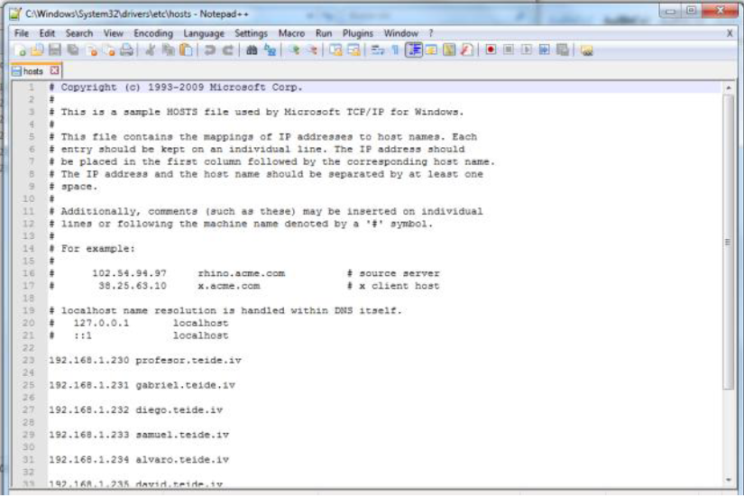

En Windows esta en: C:\Windows\System32\drivers\etc
En Linux esta en /etc/hosts

Funcionamiento
-----------------

 * **Resolucion directa:**.Dominio raíz. Se ordenan los dominios en forma de árbol
 
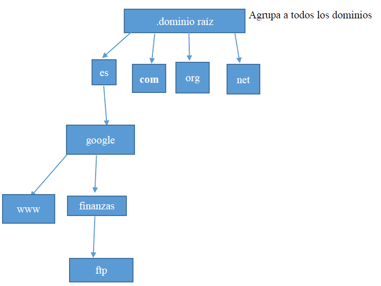

 * **FQDN (Full quality domain name):** Nombre completo de dominio
 
 
Tipos de servidores DNS
-------------------------

 * **Servidor primario:** Son configurados en ellos mismos.
 * **Servidor secundario:** Transfieren los datos de los primarios mediante una acción llamada transferencia de zona.
 * **Servidor cache:** Resuelven consultas externas y resuelven guardándolas en cache, pero no son autoridad de ninguna zona. 
 
Conocer DNS Autoritativo
--------------------------

###1ª Forma

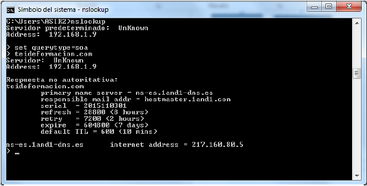

###2ª Forma

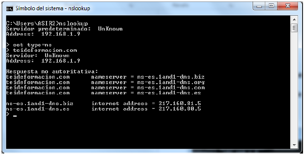

###Conocer el DNS autoritativo de un dominio de primer nivel

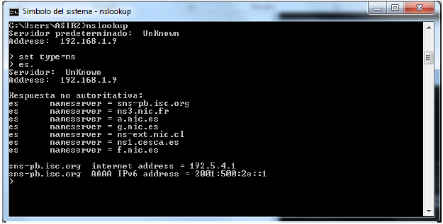

###Respuesta autoritativa DNS

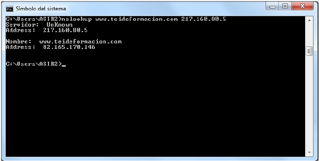

###Conocer DNS Servidor de correo

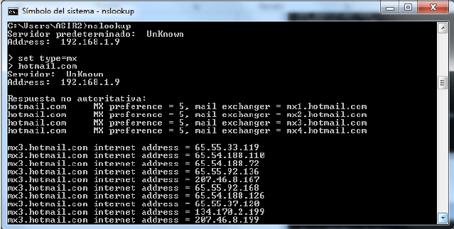

Caché
--------

Los servidores DNS guardan en cache sus registros durante un tiempo determinado. Llamado TTL (Tiempo de vida).

###Ver caché DNS: 

 * Ipconfig /displaydns

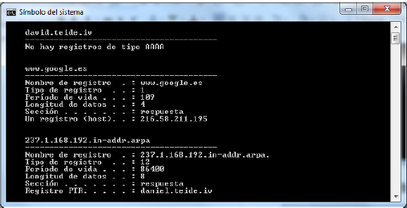

###Limpiar cache DNS

 * ipconfig /flushdns
 
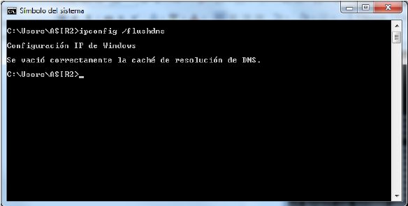

A la hora de contestar, contesta el servidor DNS más próximo, mediante el protocolo (Round Trip Time) RTT
A la hora de contestar cada zona DNS delega en otra hasta dar con la información.

Fichero configuración DNS.
----------------------------

###Configuración de rutas

**/etc/bind/named.conf.local**

Especificar las zonas de búsqueda directa e inversa del servicio DNS. El dominio de la zona directa y la subred de la zona inversa. También incluir qué tipo de servicio es (maestro o esclavo) y en que archivos hará la búsqueda de nombres.

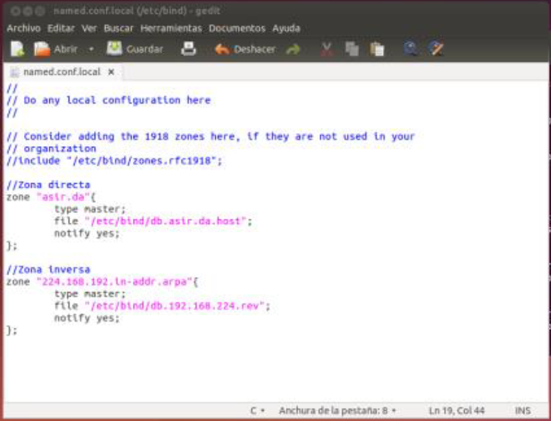

###Zona Directa

**/etc/bind/db.asir.da.host**

Este archivo contiene las tablas de búsqueda directa. Las primeras líneas son unos parámetros relacionados con la actualización del DNS (número de serie y periodos de actuación). La siguiente línea indica quién es el servidor primario (NS = Name Server). Las siguientes líneas especifican las @IP’s de los diferentes PC’s componentes del dominio (A = Address).

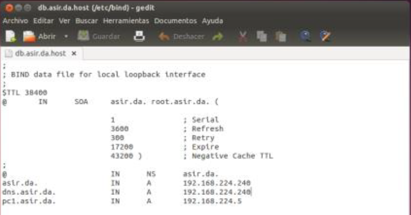

###Zona inversa

**/etc/bind/db.192.168.224.rev**

Este archivo contiene las tablas de búsqueda inversa

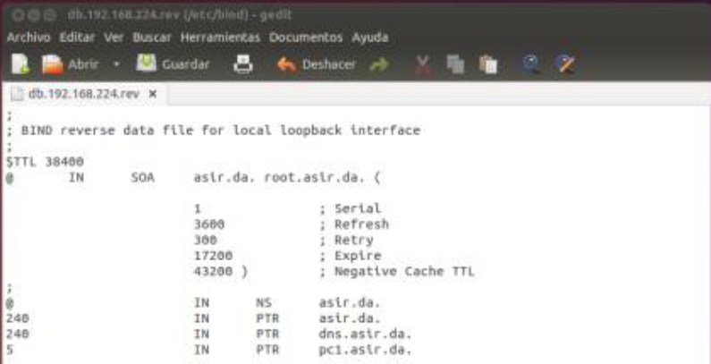

###Tipos de registro DNS

* **NS:** Especifica el nombre del dominio del servidor DNS.
* **A:** Convierte nombres de host en direcciones IP.
* **CNAME:** Crea nombres de host adicionales (ALIAS).
* **MX:** Asocia un nombre de cominio a una lista de servidores de correo.
* **PTR:** Traduce una IP a un nombre.